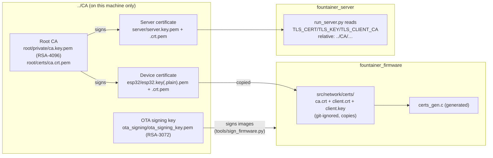

# Certificates & Keys — Structure, Usage, Re-Issuing

All cryptographic material of the testbed lives in a **private PKI outside the
Git repositories**: in the folder `../CA` — in the current testbed checkout `../DO_NOT_COMMIT/CA`, written as `../CA` below for brevity (a sibling folder of `fountainer_firmware`
and `fountainer_server`). Ground rules:

- **The CA never leaves this machine** and is not versioned in any Git
  repository. The repos contain only generated, git-ignored copies or
  embeddings.
- **No eFuses / no irreversible mechanisms** on the ESP32. The OTA signature
  check is a pure software check ("Signed App Verification
  without Secure Boot") — the chip remains fully reusable.
- Passwords for the testbed keys: see `../CA/PASSWORDS.md` (deliberately **not**
  in this repo). All testbed certificates are dummies and will be replaced for
  production use.

## 1. Overview: who holds which material?



| Material | Location | Purpose |
|---|---|---|
| Root CA (RSA-4096) | `../CA/root/` | issues server and device certificates; trust anchor for both sides |
| Server certificate (RSA-3072) | `../CA/server/` | TLS server identity (wss :8443, firmware download :8080); SAN: `192.168.1.12`, `127.0.0.1`, `server1.lab.melowsyne.com`, `localhost` |
| Device certificate (RSA-3072) | `../CA/esp32/` | mTLS client identity of the ESP32 (CN = device_id) |
| OTA signing key (RSA-3072) | `../CA/ota_signing/` | signs every firmware image (Secure Boot V2 signature block, software check during OTA) |

**Why an unencrypted device key (`esp32.key.plain.pem`)?** The
esp_websocket_client does not support a key passphrase; protecting it in flash
would only be possible via flash encryption (= eFuse), which is ruled out by
project policy. The same applies to `ota_signing_key.pem` (build automation);
a password-protected archive copy of it exists (`.enc.pem`).

## 2. How the material gets into firmware and server

- **Firmware:** `tools/ensure_network_json.py` (PlatformIO pre-script) reads
  `src/network/certs/{ca.crt.pem, client.crt.pem, client.key.pem}` and generates
  the git-ignored `src/network/certs_gen.c` from them. Missing files become
  empty strings — the firmware then falls back to unencrypted `ws://`
  (intended only for the very first bring-up). The three files are
  copies from `../CA` (`ca.crt.pem` ← `root/certs/`, `client.*` ← `esp32/`,
  where `client.key.pem` is the **plain** variant).
- **Server:** `run_server.py` receives the paths via environment variables —
  relative to the server directory:
  `TLS_CERT=../CA/server/server.crt.pem TLS_KEY=../CA/server/server.key.pem`
  `TLS_KEY_PASSWORD=<see PASSWORDS.md> TLS_CLIENT_CA=../CA/root/certs/ca.crt.pem`
- **OTA signature:** `tools/sign_firmware.py` (post-script, relative path
  `../CA/ota_signing/ota_signing_key.pem`) appends the signature block to every
  built image. If the key is missing, the build warns and leaves the image
  unsigned (a pure dev scenario — the device rejects it during OTA).

## 3. How-to guides

All commands are run in `../CA`; `<PW>` stands for the passwords from
`PASSWORDS.md`. The script reference for everything below is `../CA/gen_pki.sh` —
it is idempotent (it only creates what is missing).

### 3.1 Setting up the complete PKI from scratch

```bash
cd ../CA && ./gen_pki.sh
```
Creates the root CA, server certificate, ESP32 certificate, and OTA signing key
with the documented extensions (CA: `v3_ca`; server: `serverAuth` + SAN;
device: `clientAuth`). The validity window is deliberately 2020–2040: an ESP32
without time synchronization rejects certificates that start "in the future".

### 3.2 Issuing a new device certificate (additional device)

The CN **must** match the device's `device_id` (e.g.
`esp32-a1b2c3d4e5f6`) — the server verifies the identity against the
client certificate.

```bash
cd ../CA
ID="esp32-NEWID"                         # = device_id of the new device
mkdir -p "$ID"
# 1) Key (encrypted) + unencrypted copy for embedding
openssl genrsa -aes256 -passout pass:<GERAETE_PW> -out "$ID/$ID.key.pem" 3072
openssl rsa -in "$ID/$ID.key.pem" -passin pass:<GERAETE_PW> -out "$ID/$ID.key.plain.pem"
chmod 600 "$ID"/*.pem
# 2) CSR with CN = device_id
openssl req -new -sha256 -key "$ID/$ID.key.pem" -passin pass:<GERAETE_PW> \
    -subj "/O=Melowsyne Unipessoal Lda/CN=$ID" -out "$ID/$ID.csr.pem"
# 3) Sign with the CA (clientAuth, same validity as the existing certs)
openssl ca -batch -config openssl.cnf -notext -md sha256 -passin pass:<CA_PW> \
    -startdate 20200101000000Z -enddate 20400101000000Z \
    -extensions v3_client -in "$ID/$ID.csr.pem" -out "$ID/$ID.crt.pem"
```

Then get it onto the device:

```bash
cd ../fountainer_firmware
cp ../CA/root/certs/ca.crt.pem       src/network/certs/ca.crt.pem
cp ../CA/$ID/$ID.crt.pem             src/network/certs/client.crt.pem
cp ../CA/$ID/$ID.key.plain.pem       src/network/certs/client.key.pem
./build.sh        # the pre-script embeds the new files automatically
```
Initial delivery is done via USB (`./flash.sh`); all subsequent updates run
signed via OTA. On the server side, register the device in `devices.json`
(device_id + HMAC key).

### 3.3 Renewing the server certificate / changing the address

For a new hostname or a new IP, first adjust the SAN list in
`../CA/openssl.cnf` (`[ server_alt ]`), then:

```bash
cd ../CA
rm server/server.crt.pem server/server.csr.pem     # the key can stay
./gen_pki.sh                                        # re-issues only what is missing
```
Restart the server — the devices verify against the (unchanged) root CA and
accept the new certificate without any firmware change, as long as the
address being contacted is in the SAN list.

### 3.4 Rotating the OTA signing key (caution: order matters!)

The **public** part of the signing key is embedded in the firmware —
a running device only accepts images signed with the key that its CURRENT
firmware knows. Hence the two-stage process:

1. Build a transitional firmware that accepts **both** public keys (old + new),
   sign it with the **old** key, and roll it out via OTA.
2. Only then switch to the new key and retire the old one.

A direct swap would lock all field devices out of further OTAs
(at that point only USB can help).

### 3.5 Rotating the root CA

Same as 3.4, just one level up: roll out a transitional firmware with the old
**and** the new CA certificate in the truststore, switch the server to the new
certificate, then remove the old CA from the firmware. For the testbed, the
simpler route is often: device is reachable → new `certs/` copies → OTA.

## 4. Checklist before every commit

- `git status` must **never** show: `*.pem`, `src/network/certs/`,
  `certs_gen.c`, `network.json`, `network_json_gen.c` (all git-ignored —
  do not weaken the ignore list).
- Document new keys/passwords exclusively in `../CA/PASSWORDS.md`,
  never in repo files.
