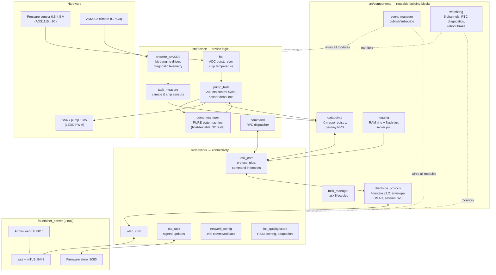
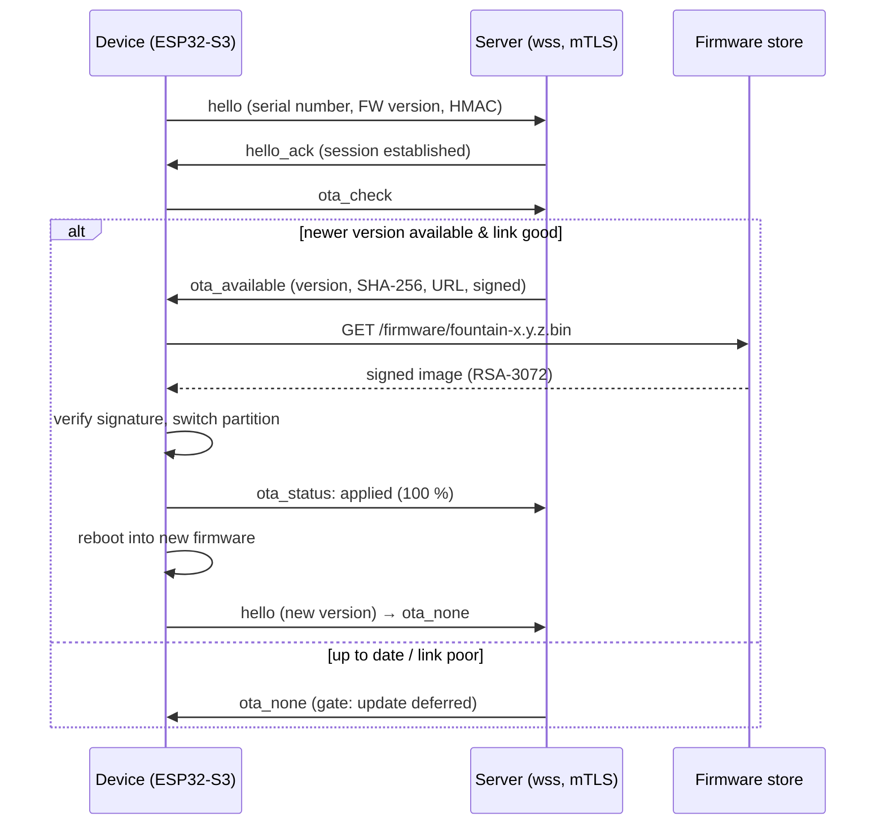

# Fountainer — networked well-pump controller on ESP32-S3

> An industrial-grade firmware/server platform that grew out of a real task:
> **regulating an 8 m deep well pump (1 kW) safely, autonomously and with remote maintenance** —
> and designed at the same time as a reusable foundation for further IoT projects.

---

## 1. What it is about

A deep well supplies house and garden. The submersible pump (1 kW, 8 m head) is
switched via a solid-state relay; the controlled variable is the **line pressure**, measured
with a 0.5–4.5 V pressure transmitter (0–500 PSI) on an external 16-bit ADC (ADS1115).
The firmware keeps the pressure within a configurable band, detects fault patterns such as
**dry run, leakage, pipe burst and defective check valves**, classifies
draw events (hand valve vs. tank fill) and reports everything to a Linux server —
encrypted, signed and offline-resilient.

The project consists of two repositories:

| Repo | Role | Technology |
|---|---|---|
| `fountainer_firmware` | Device firmware (this repo) | C, ESP-IDF 5.5, ESP32-S3, PlatformIO |
| `fountainer_server` | Operations server + web UI | Python (asyncio, websockets, aiohttp) |

**Firmware scope:** ~11,000 lines of C in cleanly separated modules, 100 datapoints,
host unit tests, signed OTA updates, mTLS communication.

---

## 2. Architecture at a glance



**Design principle:** The domain logic (`pump_manager`) is a *pure* C state machine
without any ESP dependency — it runs unchanged in the host test runner on the PC.
All cross-cutting concerns (events, logging, watchdog, datapoints, protocol) are
self-contained components and directly reusable in follow-up projects.

---

## 3. The features in detail

### 3.1 Datapoint mechanics — one line, complete behaviour

Every state and every setting of the device is a **datapoint**: typed,
access-controlled (RO/RW), persistable (NVS) and equipped with limits. The entire
registry is a single X-macro file — **one new line creates storage, validation,
persistence, network access and UI representation in one step**. Excerpt from
`src/components/datapoints/dp_list.def` (lines 100–142):

```c
DP(   Fon_Starts_Per_Hour,       U8,  RO, VOLATILE,   0, 0,       NAN,    NAN,    0     )   /*@ unit=/h @*/
/* Cumulative failed pressure readings since boot (I2C glitches etc.; a
 * sensor fault only latches after 3 CONSECUTIVE misses — debounced). */
DP(   Fon_Sensor_Err_Count,      U32, RO, VOLATILE,   0, 0,       NAN,    NAN,    0     )
/* Spread (max-min, mV) of the 4-sample ADC burst: sensor/wiring noise. */
DP(   Fon_Sensor_Noise_mV,       U16, RO, VOLATILE,   0, 0,       NAN,    NAN,    0     )   /*@ unit=mV @*/
/* Write 1 = acknowledge a latched pump fault (needs a healthy sensor);
 * polled by the pump task, always reads 0. */
DP(   Fon_Fault_Ack,             U8,  RW, VOLATILE,   0, 0,       0.0f,   1.0f,   0     )
/* Manual classification of the CURRENT/last event (0=unknown 1=none
 * 2=hand 3=tank 4=leak 5=break 6=sensor 7=maintenance); logged on change. */
DP(   Fon_Event_Label,           U8,  RW, VOLATILE,   0, 0,       0.0f,   7.0f,   0     )

/* --- Fountain configuration (RW, NVS) ----------------------------------- */
DP(   Fon_Min_Pressure,          F32, RW, NVS,      101, 2.0f,    0.0f,   10.0f,  0     )   /*@ unit=bar dec=2 @*/
DP(   Fon_Max_Pressure,          F32, RW, NVS,      102, 3.5f,    0.0f,   10.0f,  0     )   /*@ unit=bar dec=2 @*/
DP(   Fon_Alert_High_Pressure,   F32, RW, NVS,      103, 4.5f,    0.0f,   12.0f,  0     )   /*@ unit=bar dec=2 @*/
DP(   Fon_Alert_Low_Pressure,    F32, RW, NVS,      104, 0.3f,    0.0f,   10.0f,  0     )   /*@ unit=bar dec=2 @*/
DP(   Fon_Min_On_Time,           U16, RW, NVS,      105, 30,      0.0f,   3600.0f,0     )   /*@ unit=s @*/
DP(   Fon_Max_On_Time,           U16, RW, NVS,      106, 300,     10.0f,  65535.0f,0    )   /*@ unit=s @*/
DP(   Fon_Dry_Run_Detect_Time,   U16, RW, NVS,      107, 30,      1.0f,   3600.0f,0     )   /*@ unit=s @*/
/* ... */
/* --- Pump manager --------------------------------------------------------
 * Sensor full scale: keeps the original hardware value (0.5-4.5 V ->
 * 0-500 PSI = 34.47 bar) but is runtime-changeable per requirement; the
 * effective curve is bar = (V-0.5)/4.0 * Range * Fon_Sensor_Scale
 * + Fon_Sensor_Offset(mbar). Demand bands/durations classify hand valve
 * vs. tank draw; flow k-factors stay 0 until calibrated (bucket test). */
DP(   Fon_Sensor_Range_Bar,      F32, RW, NVS,      114, 34.47f,  0.1f,   100.0f, 0     )   /*@ unit=bar dec=2 @*/
DP(   Fon_Filter_Alpha,          F32, RW, NVS,      116, 0.1f,    0.01f,  1.0f,   0     )
DP(   Fon_Max_Starts_Per_Hour,   U8,  RW, NVS,      118, 10,      1.0f,   16.0f,  0     )
DP(   Fon_Hand_Min_Pressure,     F32, RW, NVS,      119, 1.7f,    0.0f,   100.0f, 0     )   /*@ unit=bar dec=2 @*/
DP(   Fon_Tank_Min_Pressure,     F32, RW, NVS,      121, 1.2f,    0.0f,   100.0f, 0     )   /*@ unit=bar dec=2 @*/
DP(   Fon_Hand_Max_Duration,     U16, RW, NVS,      123, 20,      1.0f,   1440.0f,0     )   /* min */   /*@ unit=min @*/
```

Core ideas of the mechanism:

- **Stable NVS IDs per point** ("per-key store"): Every persistent point has a fixed
  ID and is stored as its own NVS entry. Points can be reordered, added or
  removed at will — **stored customer configuration survives every firmware update**,
  including an automatic one-time migration from the older blob format.
- **Deadband reporting:** F32 points only report on relevant change — the
  1-second change reporting stays lean even over weak radio links.
- **Build lint + UI metadata:** A pre-build script (`tools/lint_datapoints.py`) enforces
  naming, limit and ID rules and exports units/decimal places/enum mappings
  as JSON — **the web UI generates its complete datapoint view from it**, with no
  duplicate maintenance.

### 3.2 Communication protocol "Fountain v2.2" — RPC, telemetry, OTA in one

A custom, lean JSON protocol over **WebSocket Secure with mutual mTLS**
(private CA, device certificates). Every message is wrapped in an **HMAC-SHA256-signed
envelope** with canonical JSON serialisation — tampering or replay is detected immediately.

The protocol combines three roles:

1. **Remote procedure calls:** The server invokes device functions (`command`:
   set_state/restart/reboot …, `dp_read`, `dp_write` with batch semantics) and receives
   type-checked, acknowledged replies (`command_result`, `mac_mismatch` protection).
2. **Telemetry:** state-driven `dp_report` messages (change reporting with
   deadband) plus heartbeat with uptime/RSSI.
3. **Log transport & OTA signalling:** The server *pulls* logs in acknowledged
   batches (`log_read`/`log_batch`/`log_ack`), also retroactively from the time **before the
   last reboot**; on connection setup, `ota_check` checks for new firmware.

### 3.3 OTA updates — signed, throttled, self-healing

- Images are **RSA-3072-signed (Secure Boot V2)**; the device verifies the signature
  before switching the boot partition. Unsigned images are rejected and logged.
- The server only offers updates during session setup (`ota_check` → `ota_available`
  with SHA-256 and download URL); the device downloads via a separate firmware endpoint.
- A **link gate** defers updates when the radio link is poor, and a
  version guard in the build prevents images with a stale embedded version
  (the cause of classic endless update loops — secured here by tooling).
- Progress and result flow back into the UI as `ota_status` telemetry.



### 3.4 Backup & trial mechanism — remote configuration without breaking a sweat

Network parameters (SSID, password, IP mode, server address) can be changed remotely
via datapoints — with a double safety net:

- **Backup set:** The last *working* configuration is stored as its own
  `Backup_*` datapoint set in NVS.
- **Trial reboot:** New Wi-Fi credentials are first activated **on a trial basis**. If the
  device does not establish a complete server session within **120 s**, it automatically rolls
  back to the old values and reports the failure — a typo in the Wi-Fi password
  can no longer strand the device in the well shaft. An NVS state machine
  survives even power failures in the middle of the trial.

### 3.5 Event management — decoupled modules

A central **publish/subscribe event manager** wires the modules together without them
knowing each other: `EVT_SYSTEM_BOOT`, `EVT_SESSION_READY/LOST`, `EVT_PUMP_FAULT`,
`EVT_NETWORK_CONFIG_RESTORED`, `EVT_LINK_POOR` … Whoever wants to react subscribes —
e.g. the session-ready subscriber confirms the Wi-Fi trial and updates the
backup set. New reactions are added without modifying the senders.

### 3.6 Logging — from RAM ring to pre-boot forensics

- **Two-tier:** 32 KB RAM ring for the current run + 2×64 KB **flash tier** (behind the
  OTA slots, detected at runtime) for persistence across reboots.
- **Server pull instead of push:** The server fetches logs in acknowledged batches — nothing
  is lost, not even on connection drops; after a crash,
  `log_read_prev` delivers the records of the **previous boot**.
- **Offline recorder:** Without a session, the device keeps recording pump telemetry on a 30 s
  grid and delivers the gap without holes afterwards — proven with a forced
  150 s radio blackout.
- **Structured records:** Stable event IDs + two arguments instead of text parsing —
  the same infrastructure carried complete **remote diagnoses** in this project (e.g.
  a sensor wiring fault narrowed down via handshake-phase telemetry,
  without connecting an oscilloscope).

### 3.7 Watchdog — monitoring with memory

Five logical channels (session, measurement, monitor, events, pump) feed a
central watchdog. Special features:

- The session channel only counts **successfully sent** frames — half-open
  TCP connections ("wedges") cannot disguise themselves as healthy.
- **RTC diagnostic memory:** On a watchdog reset, the culprit information survives the
  reboot and lands in the first log batch.
- **Reboot brake:** At most 3 consecutive watchdog restarts, then a waiting
  safe state instead of a boot loop.

### 3.8 Link robustness — designed for poor Wi-Fi in the shaft

An RSSI-based **link score** (EMA-smoothed, with POOR/GOOD hysteresis) drives
runtime adaptations: throttled report grid, reduced log batch sizes,
Wi-Fi power-save control and the OTA gate. All adaptations have been made
deterministically verifiable via a test command.

### 3.9 Pump logic — testable like a library module

The state machine knows states from `IDLE` through `RUNNING` to `FAULT` and detects:
dry run (missing pressure build-up), suspected leak (cyclic re-pumping),
pipe burst (pressure drop under load), stuck check valves, sensor failure
(3× debounced) and too frequent starts. Events are classified by pressure bands and duration
as *hand valve* or *tank fill* and logged with a volume estimate.
**32 host unit tests** cover the transitions — executable without hardware, in seconds.

---

## 4. Outlook: datapoints as training data for a Tiny LLM

The logging pipeline is deliberately laid out as a **data collection for machine learning**:
time-series records (`PM_SAMPLE`: filtered pressure, pressure gradient, state/demand)
and event summaries (`PM_EVENT`: duration, minimum pressure, volume) form,
together with the manual labels (`Fon_Event_Label`), a growing, labelled
dataset of real pump behaviour.

Planned extension: a **compact on-device model ("Tiny LLM"/TinyML) directly on the
ESP32-S3** (vector instructions of the S3 architecture) that recognises
anomalies from these patterns earlier than the rule-based logic — e.g. creeping leaks or
ageing check valves. The datapoint `Fon_Anomaly_Score` is already reserved as the output channel
for this; the control remains deterministic, the model provides a
second opinion and early warning.

## 5. Reuse: a platform, not just a project

All components under `src/components/` are deliberately cut to be project-neutral
(own include directories, no dependency on the pump logic):

- `datapoints` — declarative state/configuration registry with persistence
- `clientside_protocol` — signed, session-based device link with RPC & OTA
- `event_manager`, `task_manager`, `logging`, `watchdog` — basic operational equipment

At its core, a new device (different sensors, different actuators) only needs: its own
`dp_list.def`, its own device drivers, its own domain state machine. Server, UI,
security, OTA and diagnostics are ready.

---

## 6. Build & deployment workflow

The complete release cycle is two commands (all paths relative, the
repos sit side by side as sibling folders):

```bash
./build.sh                                  # builds + signs + verifies
./OTA_update.sh binary/fountain-4.31.1.bin  # deploys to the server
```

- **`build.sh`** builds the OTA image (PlatformIO env `esp32s3_ota`), appends the
  RSA-3072 signature block (post-script) and stores the result versioned
  under `binary/fountain-<version>.bin`. Built in is the **version guard**:
  it reads the actually embedded version from the binary's app descriptor
  and forces a clean rebuild if it deviates from `version.txt` —
  the root cause of classic endless OTA loops is thus ruled out
  on the tooling side.
- **`OTA_update.sh <file>`** checks image magic and embedded version and
  copies the file to `../fountainer_server/FIRMWARE_UPDATES/` — the
  target file name is **derived from the embedded version**, so file name and
  reported version can never diverge. The server offers the
  image at the device's next `ota_check`.
- **`flash.sh`** remains for initial commissioning: USB flash + serial
  monitor (`./flash.sh`) or build+deploy in one (`./flash.sh ota`).
- The build automatically runs: datapoint lint + UI meta export,
  `network.json`/certificate embedding, build timestamp generation
  (`Device_Build_Version`) and signing.

Details on the PKI (structure, re-issuing certificates, key rotation):
see [Certificates.md](Certificates.md).

---

## 7. Quality and security features (short list)

| Area | Measure |
|---|---|
| Transport | WebSocket Secure, **mTLS** with private CA, TLS session tickets |
| Messages | **HMAC-SHA256** envelopes, canonical JSON, replay protection |
| Firmware | **Secure Boot V2 / RSA-3072-signed OTA images** |
| Configuration | Trial commit with **automatic 120 s rollback**, backup set in NVS |
| Robustness | Watchdog channels with RTC forensics, reboot brake, offline recorder |
| Testability | Pure-C state machine with **32 host tests**, protocol **golden tests** (ABI-consistent host runner), **hardening test series** (see [Hardening_Tests_2026-07-10.md](Hardening_Tests_2026-07-10.md)) |
| Toolchain | Datapoint **lint in the build**, UI metadata export, version guard against OTA loops, build timestamp datapoint (`Device_Build_Version`) |
| Operation | ~30+ signed OTA cycles incl. passed fault tests (radio loss, power failure during/after update, tampered image), remote diagnosis purely via log telemetry |

---

## 8. Technical key data

- **MCU:** ESP32-S3 (dual-core Xtensa LX7, 16 MB flash), ESP-IDF 5.5, PlatformIO
- **Measurement chain:** ADS1115 (16-bit, 4-sample burst with trimmed mean against outliers),
  configurable sensor curve (range/scale/offset at runtime)
- **Climate sensors:** AM2302, pin-parameterised driver (multi-sensor capable) with
  remote wiring diagnostics (handshake phase, line idle level, raw frames)
- **Control cycle:** 200 ms, EMA pressure filter, step filter, 3× sensor debounce
- **Server:** Python asyncio; device WSS (8443, mTLS), firmware HTTPS (8080),
  admin web UI (8010) with live-generated datapoint view
- **Firmware code size:** ~11,000 lines of C, 100 datapoints (47 persistent)
