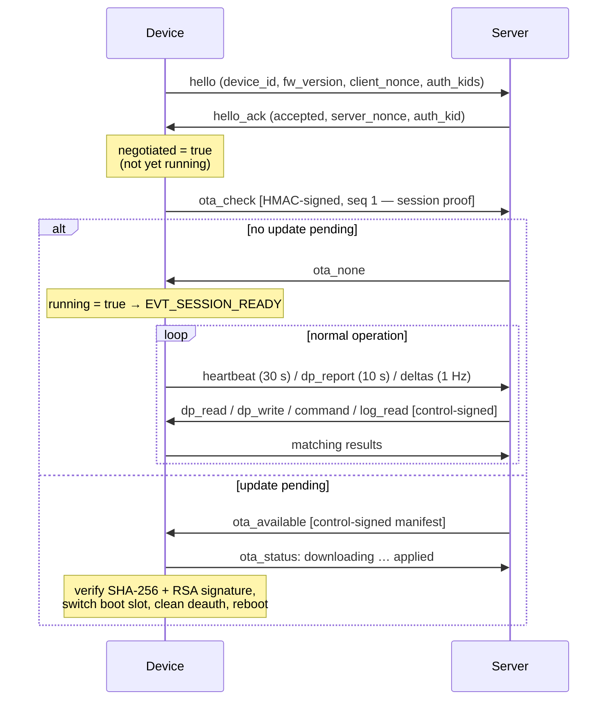

# Fountain v2.2 — Protocol Reference (Firmware Side)

Client implementation: `src/components/clientside_protocol/`
(generated message layer `fountain_msgs.{h,c}` — source of truth is
`fountain_proto_schema/schema.py` on the server side; do not edit manually).

Transport: one JSON object per WebSocket **text frame**, subprotocol
`fountain`, serialized unformatted (`cJSON_PrintUnformatted`). TLS: `wss://`
with CA pinning and a device client certificate when PKI material is
embedded; plaintext `ws://` development fallback otherwise
(`src/fp_ws.c`).

---

## 1. Envelope

Built in `fp_envelope_build` (`src/fp_envelope.c`). The envelope is **flat** —
body fields are merged into the same top-level object as the header fields.

| Field | Type | Notes |
|---|---|---|
| `v` | number | wire version per message type: `1` for the handshake family (`hello`, `hello_ack`, `protocol_mismatch`), `2` for everything else |
| `type` | string | message name (dispatch key) |
| `ts` | number | Unix time in ms; `0` until SNTP has synced |
| `serial` | string | device serial, 16 hex chars (optional) |
| `msg_id` | string | set by request-type senders (`hello-1`, `chk-1`, …) |
| `in_reply_to` | string | correlation id on responses |
| `auth` | object | `{kid, seq, mac}` — only on authenticated messages |

Constants (`fountain_msgs.h`): handshake version 1, auth scheme
`hmac-sha256`, auth scope `control`, session proof message = `ota_check`.

## 2. Message bodies

Direction **C→S** = device to server. Auth column: *none*, *session*
(signed by the device as proof), *control* (server-signed, device verifies).

### Handshake

| Message | Auth | Body fields |
|---|---|---|
| `hello` (C→S) | none | `device_id`, `protocol_version` (2), `fw_version`, `hw_rev`, `boot_reason`, `auth_schemes[]`, `auth_kids[]`, `client_nonce` (16 random bytes, base64) |
| `hello_ack` (S→C) | none | `accepted` (bool), `supported_protocols[]`, `server_ts`, `reason`, `auth_required`, `auth_scheme`, `auth_scope`, `auth_kid`, `server_nonce` |
| `protocol_mismatch` (C→S) | none | `device_protocols[]`, `server_protocols[]`, `reason` (declared; no client send site — negotiation failure currently ends in disconnect) |

### OTA

| Message | Auth | Body fields |
|---|---|---|
| `ota_check` (C→S) | **session** | `current_version`, `hw_rev` — always the first signed message of a session (seq 1) |
| `ota_available` (S→C) | **control** | `target_version`, `url`, `size`, `crc32`, `sha256`, `mandatory`, `max_attempts` (client verifies the MAC before trusting `url`/`sha256`; `crc32` is unused by the client — SHA-256 is authoritative) |
| `ota_none` (S→C) | none | empty; switches the session to *running* |
| `ota_cancel` (S→C) | **control** | `reason` (verified; cancellation of a running download is not implemented) |
| `ota_status` (C→S) | none | `target_version`, `state` (`downloading` / `applied` / `failed`), `attempt`, `progress_pct`, `error`, `error_detail` |

### Telemetry & control

| Message | Auth | Body fields |
|---|---|---|
| `heartbeat` (C→S) | none | `uptime_s`, `fw_version`, `fault_active` |
| `dp_report` (C→S) | none | `seq`, `dp{}` (name→value map), `unknown[]` (names requested via `dp_read` that do not exist) |
| `dp_read` (S→C) | none | `names[]` — empty/absent = full snapshot |
| `dp_write` (S→C) | **control** | `dp{}` — atomic batch |
| `dp_write_result` (C→S) | none | `status`, `errors{name: code}` (`type_mismatch` / `out_of_range`), `readback{}`, optional `warning: "nvs_save_failed"` |
| `command` (S→C) | **control** | `command`, `target_state`, `duration_steps` |
| `command_result` (C→S) | none | `command`, `status` (`applied` / `rejected`), `error` (e.g. `unknown_command`, `auth_failed`), `error_detail`, `retry_after_s`, `readback{}` |
| `device_alert` (C→S) | none | `code`, `severity`, `datapoint`, `value`, `threshold`, `detail` — unsolicited |
| `error_report` (C→S) | none | `status`, `active_faults[]`, `log[]` (declared; unused by the current client) |

### Remote log pull

| Message | Auth | Body fields |
|---|---|---|
| `log_read` (S→C) | **control** | `since_seq`, `min_level`, `max_records` |
| `log_read_prev` (S→C) | **control** | previous-boot log request |
| `log_batch` (C→S) | none | `boot_id`, `first_seq_available`, `next_seq`, `dropped_count`, `overflow`, `records[]` |
| `log_ack_prev` (S→C) | **control** | `boot_id` |
| `log_ack_result` (C→S) | none | `ok` |

The log-batch fill callback applies a byte budget and shrinks it to 4 KB
while the link is POOR (`task_com.c`, `cb_fill_log_batch`).

## 3. Session lifecycle

Failure paths:

- `hello_ack.accepted != true` → session aborted.
- OTA failure in any phase → `ota_status: failed/<code>` **and**
  `fountain_proto_ota_failed_note()` promotes the session to *running*
  anyway, so the device resumes telemetry instead of idling until the 180 s
  session watchdog fires.
- Unverified control message → ignored (or `command_result:
  rejected/auth_failed` for commands).
- Unknown inbound `type` → logged and ignored (forward compatibility).

Timing (configured in `task_com.c` / `fp_task.c`): heartbeat 30 s,
full report 10 s, delta check 1 Hz, slow-mode grid 60 s (entered on
power-LOW or link-POOR), session watchdog deadline 180 s.

Liveness is measured at the TX level: the watchdog heartbeat fires only when
the transmit counter actually advanced (a frame really left the socket).
This detects half-open TCP connections that never produce a WebSocket
disconnect event. Stage-1 recovery is a hard WebSocket client restart
(`fp_ws_restart`); reboot escalation is gated on Wi-Fi being up.

## 4. Message authentication (HMAC-SHA256)

Implementation `src/fp_auth.c`; mirror of the server's `auth.py` and byte-for
byte compatible (verified by a golden-vector host test,
`test/host/test_auth_golden.c`).

1. **Body hash** — duplicate the message, strip the envelope keys
   (`v,type,serial,ts,msg_id,in_reply_to,auth`), canonicalize (JCS-style:
   sorted object keys, no whitespace, shortest float round-trip probing
   15→17 significant digits to match Python `json.dumps`), SHA-256, hex.
2. **MAC input** — a `0x1F`-separated vector of 13 fields:
   `v, type, direction, device_id, serial, ts, msg_id, in_reply_to, kid,
   seq, server_nonce, client_nonce, body_hash`.
3. **MAC** — HMAC-SHA256 with the 32-byte device key, truncated to the first
   **128 bits**, base64 → `auth: {kid, seq, mac}`.
4. **Replay protection** — per-direction strictly increasing `seq`;
   `fp_replay_check` rejects `seq <= last_seen`. Counters reset per
   connection (fresh nonces make old MACs worthless across sessions).

Signed by the client: `ota_check` only (the session proof).
Verified by the client: every *control*-scope inbound message
(`ota_available`, `ota_cancel`, `command`, `dp_write`, `log_read`,
`log_read_prev`, `log_ack_prev`).

Key material on the testbed is a hardcoded development key
(`task_com.c`); the production plan moves it to flash-encrypted NVS or the
HMAC eFuse block (see README, *Security* chapter).

## 5. Integration surface (`fp_config_t`)

The protocol component is application-agnostic. The application (the only
integrator is `src/network/task_com.c`) supplies:

- identity + credentials: `device_id`, `serial`, `fw_version`, `hw_rev`,
  `auth_key`, `auth_kid`, `bearer_token`, TLS PEM pointers;
- endpoint: host, port, path;
- timing: `heartbeat_s`, `report_s`;
- callbacks: `fill_snapshot`, `fill_changes`, `on_command`, `on_dp_write`,
  `on_ota`, `fill_log_batch`, `on_ready`, `on_session_lost`, `on_alive`.

Public API beyond `fountain_proto_start`: `fountain_proto_alert_send`,
`fountain_proto_ota_status_send`, `fountain_proto_slow_mode_set`,
`fountain_proto_recover`, `fountain_proto_ota_failed_note`,
`fountain_proto_running`, TX statistics.
