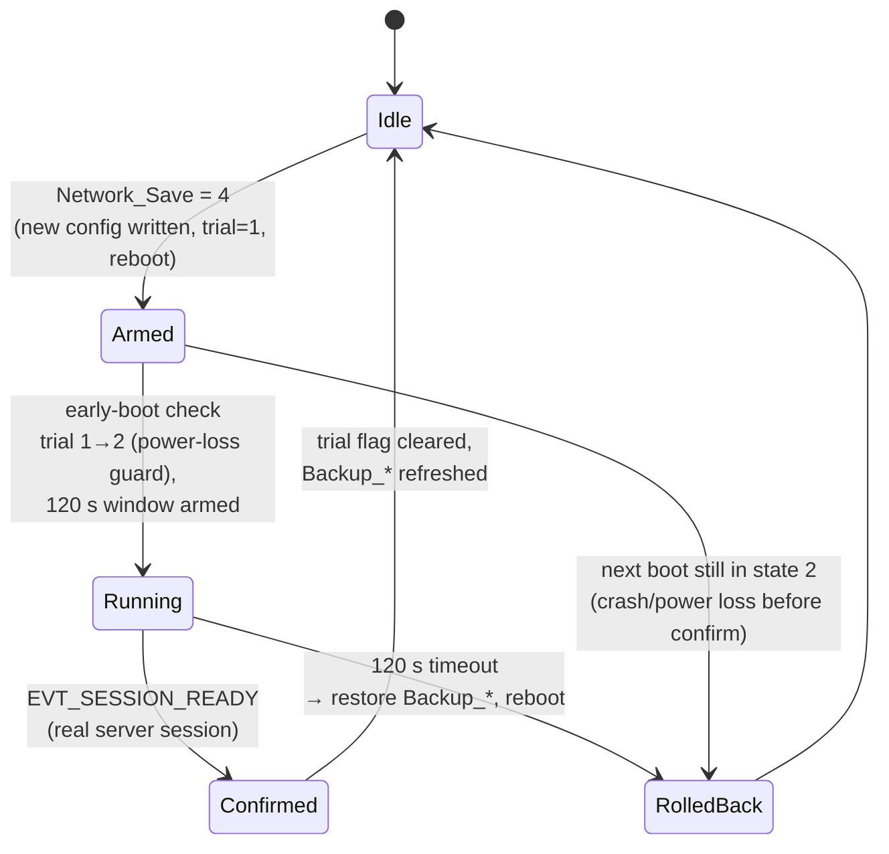

# Robustness & Self-Healing — Reference

The firmware is designed to run unattended on a well pump: every layer that
can wedge — Wi-Fi, TLS session, protocol tasks, sensors, the pump loop
itself — is supervised, and every recovery action is staged from cheapest to
most drastic. This document covers the four mechanisms in detail.

---

## 1. Watchdog cascade

Component `src/components/watchdog/` (generic engine) + project table
`src/main/watchdog_table.c` (channels). The app watchdog measures
**progress**, not mere task scheduling: a channel heartbeat is only fed after
real work succeeded.

| Channel | Deadline | Soft retries | Soft recovery | Reboot escalation |
|---|---|---|---|---|
| `session` | 180 s | 5 | hard WebSocket client restart (`fountain_proto_recover`) | only while Wi-Fi is connected (`reboot_allowed` gate — rebooting cannot fix a down link) |
| `measure` | 15 s | 1 | — | yes |
| `monitor` | 15 s | 1 | — | yes |
| `event` | 30 s | 1 | — | yes |
| `pump` | 2 s | 1 | — | yes (safety-critical 200 ms loop; the pre-reboot hook forces the relay OFF first) |

Safety net ordering:

1. **Soft recovery** per channel (e.g. WS restart for `session`).
2. **Escalated reboot** via the single deferred-reboot path
   (`system_reboot_deferred` → clean Wi-Fi deauth → `esp_restart`).
3. **Reboot-loop brake** — a diagnosis struct in `RTC_NOINIT` memory counts
   watchdog reboots; after **3** reboots without an intervening successful
   server session the escalation stops (the device keeps running degraded
   rather than boot-looping). The last channel/checkpoint and the reboot
   count are mirrored into `System_WD_*` datapoints and published as
   `EVT_WD_BOOT_DIAGNOSIS` after boot, so the server sees *why* the device
   restarted.
4. **Hardware TWDT** — 60 s, panic handler, as the last line beneath
   everything (also armed during the init sequence itself).

### Half-open session detection

The `session` heartbeat is wired to `on_alive`, which fires only when the
transmit-success counter actually advanced — i.e. a frame verifiably left
the device. A half-open TCP connection (router reboot, NAT timeout) keeps
the WebSocket client "connected" without ever raising a disconnect event;
tying liveness to TX progress catches exactly this case within one deadline.

### TX serialization (deadlock guard)

All protocol sends go through a dedicated `fp_tx` task and a depth-8 queue.
Nothing ever sends from within the WebSocket event callback (which would
self-deadlock the client), and the send call uses a bounded 10 s timeout —
a wedged socket drops a frame instead of hanging a task.

---

## 2. Link supervision (Link_Robustness_v1)

Split into a **pure scorer** (`network/link_score.c` — host-tested, no
ESP-IDF) and the **integration** (`network/link_quality.c`, ticked every 5 s
by the monitor task).

- Score 0–100 from an RSSI base curve minus capped penalties for session
  drops, send failures, and offline time; EMA-smoothed (α 0.3).
- Hysteresis: **POOR below 40, GOOD again above 55** — no flapping.
- State and counters are mirrored into the `Net_*` datapoints and logged as
  structured records (`NET_SAMPLE`, `LINK_POOR`, `RECOVERED`).

POOR has three consumers:

1. **OTA gate** — downloads are refused while POOR (`esp_https_ota` cannot
   resume; the server re-offers on the next connect).
2. **Slow mode** — heartbeat and reporting collapse to a synchronized 60 s
   grid (also entered on power-LOW).
3. **Log budget** — remote log pulls shrink to a 4 KB batch budget.

### Wi-Fi reconnect backoff

`network/wlan_com.c` reconnects on an escalating one-shot timer:
**5 → 10 → 20 → 40 → 80 → 120 s**, reset to 5 s once an IP is obtained.
Rationale (encoded as a comment at the definition site): sub-second retry
floods trigger AP anti-DoS/association lockouts (802.11 status 30) that
sometimes only an AP restart clears — few, escalating attempts with a long
quiet window let a lockout expire on its own.

Before **every** planned reboot the firmware performs a protected deauth and
waits for the disconnect event plus a settle delay
(`wlan_com_teardown_for_reboot`): this releases the 802.11w security
association on the AP immediately. Without it, an AP holding a stale SA
answers the rebooted device with "association refused temporarily" comeback
times of minutes (esp-idf issue #9428). Power-save is forced off while
connecting for a robust 4-way handshake.

---

## 3. Network trial reboot (power-loss-safe remote reconfiguration)

`network/network_config.c`. Changing Wi-Fi/server settings remotely is the
one operation that can permanently strand a device — so it is guarded by a
commit/confirm state machine anchored in NVS (namespace `netcfg`, key
`trial`) and checked **in early boot, before Wi-Fi starts**:

Key properties:

- The flag transition 1→2 at boot means a crash or power loss anywhere in
  the window is indistinguishable from a failed config — the next boot rolls
  back to the known-good `Backup_*` set *before* attempting to connect.
- Confirmation is not "Wi-Fi associated" but a **fully authenticated server
  session** (`EVT_SESSION_READY`) — the only state that proves the new
  config actually works end-to-end.
- The current state is observable via the `Network_Trial_State` datapoint
  (0 idle / 1 running / 2 confirmed / 3 rolled back).
- `Network_Save = 1/2/3` provide the simpler variants: persist,
  persist + reboot, restore backup.

This is the firmware's early-boot safety mechanism. Note that it applies to
**network configuration**, not firmware images — OTA safety is handled by the
A/B slot scheme with verify-before-activate (see the README's OTA chapter).

---

## 4. Power management

`core/power_mgmt.c` — a deliberately simple two-state model:

- **HIGH**: 160 MHz, no modem sleep — entered on any activity
  (`power_mgmt_activity_note`, e.g. OTA start, active dp_read).
- **LOW**: 80 MHz DFS + modem power save — entered after 300 s idle
  (pump idle *and* no session activity, providers injected from main).

State changes publish `EVT_POWER_MODE_CHANGED`; LOW combines with link-POOR
into the protocol slow mode (60 s grid) via `comm_adaptation_apply` in
`main.c`. The `Net_PS_Override` datapoint forces the radio power-save
behavior (0 auto / 1 never sleep / 2 always sleep) for diagnosis.

---

## 5. Structured logging (diagnosis backbone)

`src/components/logging/` — a 32 KiB RAM ring of fixed-size records
(module id, event id, 4 args, 48-char text) with an optional flash tier
(dedicated 128 KiB `logstore` partition, runtime-detected, WARN/ERROR only,
written by a low-priority queue task). Bridges capture ESP-IDF log output
and event-manager events into records.

The server pulls logs over the protocol (`log_read` / `log_batch`) including
the **previous boot's** log (`log_read_prev` / `log_ack_prev`) — crash
diagnosis without a USB cable. Runtime verbosity is a datapoint
(`Log_Runtime_Level` / `Log_Flash_Level`), so a device can be switched to
TRACE remotely, inspected, and switched back.
