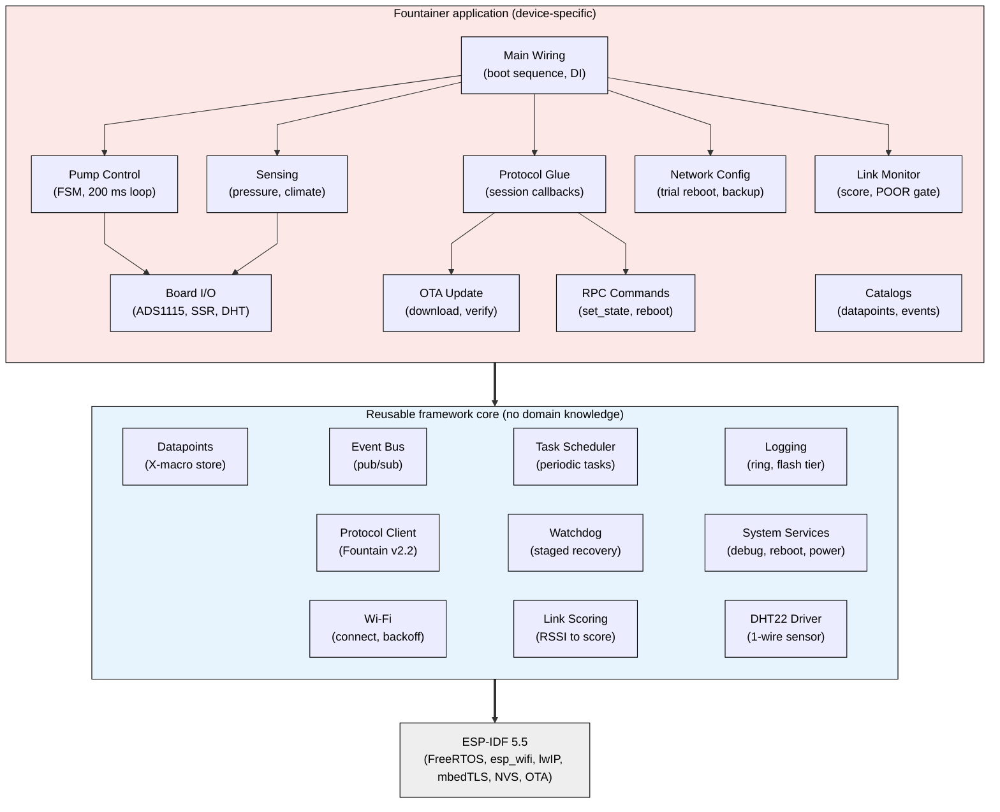
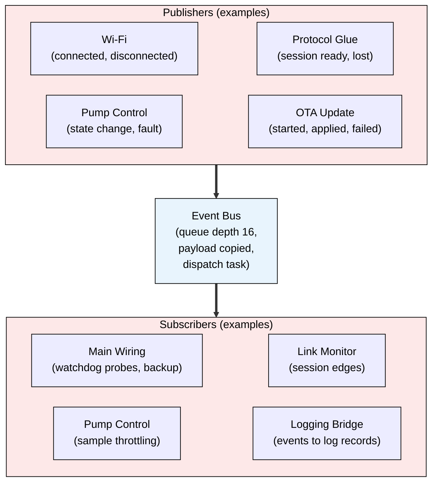
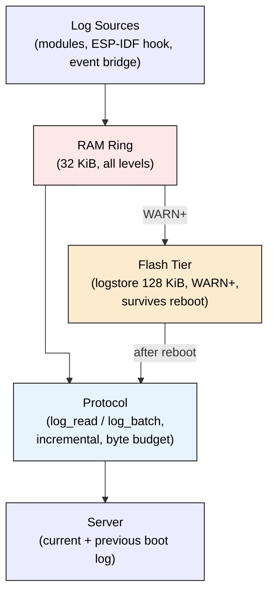
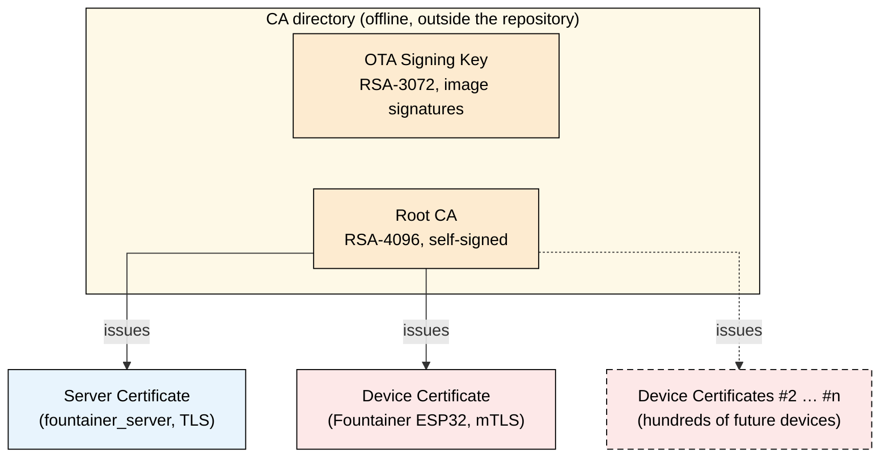

# fountainer_firmware — ESP32-S3 Well-Pump Controller

Firmware for the networked, pressure-regulated control of a deep-well pump
(1 kW, 8 m head). The device communicates encrypted (WSS + mutual TLS,
HMAC-signed messages) with the Linux server
[`fountainer_server`](https://github.com/melowsyne/fountainer_server)
and is serviced remotely via signed OTA updates.

PlatformIO / ESP-IDF project (ESP-IDF 5.5, ESP32-S3, 16 MB flash).
Current firmware version: see [`version.txt`](version.txt).

**Contents:**
[Architecture](#firmware-architecture) ·
[Protocol](#fountain-v22-protocol) ·
[OTA](#ota-update-process) ·
[Security & certificates](#security--certificate-structure) ·
[Robustness](#robustness--self-healing) ·
[Build & test](#build-flash--test) ·
[Server](#server-companion) ·
[Documentation](#documentation) ·
[License](#license)

---

## Firmware architecture

The firmware is deliberately split into a **reusable framework core** —
components and infrastructure that contain no pump knowledge and can carry any
future ESP32 device — and a thin **Fountainer application layer** that binds
the framework to this board, this sensor set, and the pump domain logic.



*Diagram 1: Module structure — the device-specific application layer on top
of the reusable framework core; each layer depends only on the layer below.*

The boundary is enforced by design patterns, not by convention alone: the
framework components receive their application knowledge exclusively through
**injected callbacks and external tables** — `fp_config_t` callbacks for the
protocol, `dp_list.def` for the data-point catalog, `system_events.h` for the
event vocabulary, `main/task_table.c` and `main/watchdog_table.c` for the
periodic tasks and supervision channels. Swapping the application layer swaps
the product.

| Layer | Path | Contents |
|---|---|---|
| Application glue | `src/main/` | `main.c` (init sequence, DI wiring, 5 s monitor cycle), `task_table.c`, `watchdog_table.c` |
| Domain logic | `src/device/` | `pump_manager` (pure FSM, host-tested), `pump_task`, `task_measure`, `command`, `hal`, `onewire_am2302` |
| Connectivity | `src/network/` | `wlan_com`, `task_com`, `ota_task`, `network_config`, `link_quality`, `link_score`, `net_utils` |
| Framework components | `src/components/` | `clientside_protocol`, `datapoints`, `event_manager`, `task_manager`, `logging`, `watchdog` |
| Tooling | `tools/` | data-point lint + UI meta export, cert/network embedding, build timestamp, OTA signing |

*Table 1: Source-tree layout — which directory holds which layer of the
firmware.*

### Task model

| Task | Prio | Core | Trigger | Purpose |
|---|---|---|---|---|
| `pump_task` | 6 | 1 | 200 ms | pressure control loop, safety-critical |
| `app_wd` | 6 | 0 | 2 s | watchdog channel checks |
| `reboot` | 6 | — | one-shot | deferred clean reboot |
| `event_mgr` | 5 | — | queue | pub/sub dispatch |
| `fp_task` / `fp_tx` | 5 | — | 1 s / queue | protocol supervisor / serialized TX |
| `com_starter` | 5 | 1 | semaphore | starts protocol once Wi-Fi is up |
| `task_measure` | 4 | 1 | 5 s | pressure/climate sensing |
| `ota` | 4 | — | on demand | OTA download/verify |
| `main_monitor` | 3 | 0 | 5 s | system datapoints, ticks |
| `log_flash` | 2 | — | queue | flash log tier writer |

*Table 2: FreeRTOS task model — priority, core pinning and trigger of every
application task.*

### Event handling

Cross-task communication runs through the **event manager** — a queue-backed
publish/subscribe bus with a project-wide event vocabulary
(`system_events.h`: `EVT_SYSTEM_BOOT` … `EVT_LINK_STATE_CHANGED`). A
publisher copies its payload (up to 64 bytes) into the queue and continues
immediately; a dedicated dispatch task delivers each event to up to 8
subscribers. Publishers therefore never block on subscribers, ISR-safe
publishing exists, and queue overflows are counted in the
`System_Event_Drops` datapoint. The protocol TX path is additionally
serialized through its own queue task — no module ever sends from a
WebSocket callback (self-deadlock guard).



*Diagram 2: Event handling — modules publish typed events into the
queue-backed event bus; the dispatch task copies each payload and notifies
the subscribers, decoupling all tasks from one another.*

### Logging

Diagnostics are **structured records**, not text lines: each record carries a
module id (SYSTEM, WLAN, PUMP, OTA, …), an event id, up to four numeric
arguments, a short text and a sequence number. Levels run from OFF to TRACE;
`Log_Runtime_Level` filters only the local console output and
`Log_Flash_Level` the flash tier — **storage always records every level,
DEBUG and TRACE included**, so the server can filter at retrieval time
(`min_level`) instead of losing detail at emit time. Two bridges feed
additional sources into the same stream: hooked ESP-IDF log output and all
event-bus events.

**Storage** is two-tiered. Every record first lands in a **32 KiB RAM
byte-ring** (`log_ring`, a pure, host-tested core with no IDF dependencies):
variable-length records instead of fixed 84-byte slots give roughly twice
the history depth in the same memory; the oldest records are overwritten and
counted in `Log_Dropped`. Records at WARN or
above are additionally queued to a low-priority writer task that persists
them into the dedicated 128 KiB **`logstore` flash partition** (two
alternating 64 KiB slots, detected at runtime) — this tier survives reboots
and power loss, which is what makes post-mortem analysis possible.

**Transfer** is server-pulled over the protocol, never pushed: the server
sends `log_read` (`since_seq`, `min_level`, `max_records`) and receives a
`log_batch` with the records plus bookkeeping (`boot_id`, sequence window,
drop counters). Pulls are incremental via the `Log_Next_Seq` datapoint, run
under a byte budget (shrunk to 4 KB while the link is POOR), and a normal
`dp_read` keeps working during a pull. After a crash or watchdog reboot the
server retrieves the **previous boot's log** with `log_read_prev` and
acknowledges it with `log_ack_prev` — crash diagnosis without a USB cable.
Local console output is meant for bench use over USB only.



*Diagram 3: Logging pipeline — structured records are buffered in the RAM
ring, WARN+ records persist to the flash tier, and the server pulls both
incrementally over the protocol.*

### Pressure history

Independently of the delta-filtered `dp_report` telemetry, the pump task
records **exactly one pressure sample per second** into a dedicated ring
(`src/components/pressure_history/`): 100 samples of 12 bytes each
(`sequence`, `timestamp_ms`, `pressure_mbar`, status bits VALID /
SENSOR_ERROR / OUT_OF_RANGE / STALE / MANUAL), oldest overwritten with an
`overwritten` counter — sequence gaps are never silent. The server pulls the
ring with the signed `history_read` → `history_batch` message pair
(non-destructive `since_seq` cursor, so the cloud poller and the local
maintenance access can read independently) and **backfills its pressure
graph** after connectivity gaps of up to ~100 s — the chart shows a gap-free
1 Hz curve even across the reconnects a poor link produces. Diagnostics are
mirrored in the `Pressure_Hist_*` datapoints; older firmware simply ignores
`history_read`, so the feature degrades gracefully across mixed fleets. The
ring core (`pressure_ring.c`) is pure and host-tested like `log_ring`.

---

## Fountain v2.2 protocol

JSON over a single WebSocket connection (subprotocol `fountain`), one message
per text frame. The envelope is flat: `v` (wire version 2; handshake 1),
`type`, `ts` (Unix ms, 0 until SNTP sync), `serial`, `msg_id`,
`in_reply_to`, and an optional `auth` object.

### Message catalog

| Type | Direction | Auth | Purpose |
|---|---|---|---|
| `hello` / `hello_ack` | C→S / S→C | none | identity, protocol + auth negotiation, nonce exchange |
| `ota_check` | C→S | **session (signed)** | update inquiry — doubles as the session proof |
| `ota_available` / `ota_none` / `ota_cancel` | S→C | control / none / control | signed update manifest (version, URL, size, SHA-256) or go-ahead |
| `ota_status` | C→S | none | download/apply progress and errors |
| `heartbeat` | C→S | none | liveness: uptime, fw version, fault flag |
| `dp_report` | C→S | none | full snapshot or on-change delta of datapoints |
| `dp_read` | S→C | none | request snapshot (named list or all) |
| `dp_write` / `dp_write_result` | S→C / C→S | **control** | atomic, validated config writes with readback |
| `command` / `command_result` | S→C / C→S | **control** | RPCs (see below) |
| `device_alert` | C→S | none | unsolicited fault/threshold alert |
| `log_read`, `log_read_prev`, `log_ack_prev` / `log_batch`, `log_ack_result` | S→C / C→S | **control** / none | remote pull of the structured log ring (current or previous boot) |
| `history_read` / `history_batch` | S→C / C→S | **control** / none | incremental pull of the 1 Hz pressure-sample ring (graph backfill after connectivity gaps) |

*Table 3: Fountain v2.2 message catalog — direction and authentication scope
of every message type.*

### Session lifecycle

1. **Connect** → device sends `hello` (device id, fw version, hw rev,
   supported auth schemes, random client nonce).
2. **`hello_ack`** → server accepts, supplies its nonce and the HMAC key id.
3. **`ota_check`** — the first *signed* message (seq 1) proves key possession.
   The session does **not** enter normal operation until the update question
   is answered.
4. **`ota_none`** → session is *running*: heartbeat every 30 s, full
   `dp_report` every 10 s, on-change deltas checked at 1 Hz. Under low power
   or a poor link both collapse to a synchronized 60 s slow-mode grid.

### Message authentication

Control messages carry an HMAC-SHA256 MAC over a canonicalized body
(JCS-style key sorting, shortest float round-trip — byte-identical to the
Python server) plus a 13-field context vector (type, direction, device id,
timestamps, nonces, sequence, body hash). MACs are truncated to 128 bit;
strictly increasing per-direction sequence numbers give replay protection.
Details: [DOKU/Protocol_Reference.md](DOKU/Protocol_Reference.md).

### Datapoints

A single X-macro file — `src/components/datapoints/dp_list.def` — declares
every datapoint (107: identity, system health, link quality, ambient
climate, pump measurement + configuration, network + backup config, logging,
pressure history).
One line generates the enum, the RAM store, the descriptor table, and the NVS
default. Reports are periodic (full snapshot) plus on-change for
booleans/enums and deadband-filtered analogs; `dp_write` batches are
all-or-nothing with type, range, and cross-field validation (e.g.
`Min < Max < AlertHigh` pressure). Engine details:
[DOKU/Datapoints.md](DOKU/Datapoints.md).

Excerpt from the definition file — one line per datapoint, everything else
is generated:

```c
/*  DP( name, type, access, persist, id, default, min, max, deadband )
 *    type     : BOOL U8 U16 U32 U64 I8 I16 I32 F32 ENUM STR
 *    access   : RO | RW | WO          persist: VOLATILE | NVS | STATIC
 *    id       : stable NVS key ("d<id>", never reused); 0 for VOLATILE/STATIC
 *    min,max  : validation bounds for RW writes; NAN = unbounded
 *    deadband : analog on-change threshold; 0 = periodic-only            */

DP(   Fon_Current_Pressure,      F32, RO, VOLATILE,   0, 0,       NAN,    NAN,    0.05f )
DP(   Fon_Min_Pressure,          F32, RW, NVS,      101, 2.0f,    0.0f,   10.0f,  0     )
DP(   Network_Server_Port,       U16, RW, NVS,      204, 8443,    1.0f,   65535.0f,0    )
DP(   Log_Command,               U8,  RW, VOLATILE,   0, 0,       0.0f,   3.0f,   0     )
```

*Listing 1: Source excerpt from `src/components/datapoints/dp_list.def`
(lines 84, 123, 166, 217) — four representative datapoint definitions: an
analog measurement with on-change deadband, an NVS-persisted config value
with validation bounds, a network setting, and a command point. One `DP(...)`
line fully defines a datapoint; enum, RAM store, descriptor table and NVS
default are generated from it at build time.*

<details>
<summary><strong>Complete datapoint catalog (107 points)</strong> — click to expand</summary>

#### Device identity (RO, STATIC — fixed at boot)

| Datapoint | Type | Purpose |
|---|---|---|
| `Device_Serial_Number` | U64 | Unique device serial; sent as 16-digit uppercase hex string on the wire. |
| `Device_HW_Version` | STR | Hardware revision of the board. |
| `Device_SW_Version` | STR | Firmware version (from `version.txt`, same string the OTA compare uses). |
| `Device_Build_Version` | U64 | Unix timestamp (ms) of the firmware build, embedded by `tools/gen_build_info.py` — distinguishes two builds of the same version. |

#### System health (RO, VOLATILE — refreshed by the 5 s monitor cycle)

| Datapoint | Type | Purpose |
|---|---|---|
| `System_Temperature` | F32 (°C, deadband 1.0) | Internal chip temperature of the ESP32-S3. |
| `System_Utilization` | U8 (%) | CPU utilization (FreeRTOS runtime stats). |
| `System_Memory_Free` | U32 (B) | Currently free heap. |
| `System_Min_Memory_Free` | U32 (B) | Low-water mark of free heap since boot (leak indicator). |
| `System_Flash_Free` | U32 (B) | Free flash space. |
| `System_RSSI` | I8 (dBm) | Wi-Fi signal strength. |
| `System_Uptime` | U32 (s) | Time since boot. |
| `System_Reconnect_Count` | U32 | Unexpected Wi-Fi link losses since boot (each schedules a backoff reconnect). |
| `System_Reset_Reason` | ENUM | Last reset cause: 1 power-on, 3 software, 4 panic, 5–7 watchdog, 9 brownout. |
| `System_Power_Mode` | U8 | 0 = HIGH (160 MHz, no power save), 1 = LOW (80 MHz DFS, modem sleep, 60 s protocol grid). |
| `System_Event_Drops` | U32 | Event-manager queue overflows since boot — should stay 0. |

#### Watchdog boot diagnosis (RO, VOLATILE — filled after a watchdog reboot)

| Datapoint | Type | Purpose |
|---|---|---|
| `System_WD_Last_Channel` | U8 | Which supervision channel escalated the last watchdog reboot. |
| `System_WD_Last_Checkpoint` | U16 | Last checkpoint that channel reached before stalling. |
| `System_WD_Reboot_Count` | U8 | Reboot-brake counter (reboots without a successful session; at 3 the watchdog stops rebooting until power cycle). |

#### Link quality (RO, VOLATILE — Link_Robustness_v1)

| Datapoint | Type | Purpose |
|---|---|---|
| `Net_Link_Score` | U8 | Link quality 0–100 (RSSI base curve minus penalties, EMA-smoothed). |
| `Net_Link_State` | U8 | 0 = GOOD, 1 = POOR (hysteresis: POOR < 40, GOOD > 55). POOR gates OTA and enables slow mode. |
| `Net_Session_Drops` | U32 | Lost protocol sessions since boot. |
| `Net_Send_Fail_Count` | U32 | Failed frame transmissions. |
| `Net_Offline_Seconds` | U32 (s) | Cumulative time without a session. |
| `Net_Last_Offline_S` | U32 (s) | Duration of the most recent offline period. |

#### Ambient climate (RO, VOLATILE — AM2302 on GPIO 4, 60 s interval)

| Datapoint | Type | Purpose |
|---|---|---|
| `Ambient_Temperature` | F32 (°C, deadband 0.2) | Air temperature at the installation site. |
| `Ambient_Humidity` | F32 (%rH, deadband 1.0) | Relative humidity at the installation site. |

#### Fountain measurement & status (RO, VOLATILE — written by the pump module)

| Datapoint | Type | Purpose |
|---|---|---|
| `Fon_Current_Pressure` | F32 (bar, deadband 0.05) | Current line pressure (calibrated). |
| `Fon_Sensor_Voltage_mV` | U32 (mV) | Raw sensor voltage; < 500 mV (the 0-PSI point) indicates a broken wire or sensor. |
| `Fon_Current_State` | ENUM | Current state of the pump state machine (Off/On/Auto/Manual plus internal states). |
| `Fon_Relay_Output` | BOOL | Actual SSR/pump relay output. |
| `Fon_Run_Time` | U32 (s) | Runtime of the current/last pump run. |
| `Fon_Cycles_Total` | U32 | Total pump start cycles. |
| `Fon_Remaining_Time` | U32 (s) | Remaining runtime of a timed run (`turn_on_duration`). |
| `Fon_Pressure_Filtered` | F32 (bar, deadband 0.05) | EMA-filtered pressure (regulation input). |
| `Fon_Pressure_Slope` | F32 (bar/s, deadband 0.01) | Pressure gradient — rise/fall rate. |
| `Fon_Demand_State` | ENUM | Demand classification: 0 none, 1 unknown, 2 hand valve, 3 tank draw, 4 leak suspect, 5 pipe break, 6 sensor. |
| `Fon_Anomaly_Score` | U16 | Anomaly score of the pump-manager observation layer. |
| `Fon_Event_Duration` | U32 (s) | Duration of the current demand event. |
| `Fon_Est_Flow_L_Min` | F32 (l/min, deadband 0.1) | Estimated flow (requires calibrated k-factor). |
| `Fon_Est_Volume_Total` | F32 (l, deadband 0.5) | Estimated cumulative delivered volume. |
| `Fon_Fault_Code` | U8 | Latched fault: 0 none, 1 sensor, 2 critical-low, 3 max-runtime, 4 dry-run, 5 starts/hour. |
| `Fon_Starts_Per_Hour` | U8 (/h) | Pump starts in the last hour (wear guard input). |
| `Fon_Sensor_Err_Count` | U32 | Cumulative failed pressure readings (I2C glitches etc.); a sensor fault only latches after 3 consecutive misses. |
| `Fon_Sensor_Noise_mV` | U16 (mV) | Spread (max−min) of the 4-sample ADC burst — early indicator of wiring/grounding issues. |

#### Fountain controls (RW, VOLATILE — command-style, polled by the pump task)

| Datapoint | Type | Range | Purpose |
|---|---|---|---|
| `Fon_Fault_Ack` | U8 | 0–1 | Write 1 to acknowledge a latched pump fault (requires a healthy sensor); always reads 0. |
| `Fon_Event_Label` | U8 | 0–7 | Operator classification of the current/last demand event (0 unknown, 1 none, 2 hand, 3 tank, 4 leak, 5 break, 6 sensor, 7 maintenance); logged on change. |
| `Fon_Pressure_Manual` | BOOL | — | 1 = simulation override: `Fon_Pressure_Value` feeds the control chain instead of the sensor. Volatile on purpose — every reboot returns to the real sensor. |
| `Fon_Pressure_Value` | F32 | 0–100 bar | Simulated pressure used while the override is active. |

#### Fountain configuration (RW, NVS, ids 101–127)

| Datapoint | [id] | Default | Range | Purpose |
|---|---|---|---|---|
| `Fon_Min_Pressure` | 101 | 2.0 bar | 0–10 | AUTO mode: pump starts below this pressure. |
| `Fon_Max_Pressure` | 102 | 3.5 bar | 0–10 | AUTO mode: pump stops at this pressure. |
| `Fon_Alert_High_Pressure` | 103 | 4.5 bar | 0–12 | Overpressure alert threshold. |
| `Fon_Alert_Low_Pressure` | 104 | 0.3 bar | 0–10 | Critically-low-pressure alert threshold. |
| `Fon_Min_On_Time` | 105 | 30 s | 0–3600 | Minimum runtime once started (anti-chatter). |
| `Fon_Max_On_Time` | 106 | 300 s | 10–65535 | Safety runtime cutoff → max-runtime fault. |
| `Fon_Dry_Run_Detect_Time` | 107 | 30 s | 1–3600 | Window after start in which pressure must rise. |
| `Fon_Dry_Run_Min_Rise` | 108 | 100 mbar | 0–10000 | Minimum pressure rise within that window; less → dry-run fault. |
| `Fon_Check_Valve_Timeout` | 109 | 10 s | 1–3600 | Check-valve supervision timeout. |
| `Fon_Pressure_Drop_Rate` | 110 | 500 | 0–65535 | Pressure-drop-rate threshold for demand/leak detection. |
| `Fon_Report_Interval` | 111 | 10 s | 1–3600 | Reporting interval of the pump values. |
| `Fon_Sensor_Offset` | 112 | 0 mbar | −5000…5000 | Additive sensor calibration. |
| `Fon_Sensor_Scale` | 113 | 1.0 | — | Multiplicative sensor calibration. |
| `Fon_Sensor_Range_Bar` | 114 | 34.47 bar | 0.1–100 | Sensor full scale (0.5–4.5 V → 0–500 PSI); curve: `bar = (V−0.5)/4.0 × Range × Scale + Offset`. |
| `Fon_Min_Off_Time` | 115 | 30 s | 0–3600 | Minimum pause between two runs. |
| `Fon_Filter_Alpha` | 116 | 0.1 | 0.01–1 | EMA coefficient of the pressure filter. |
| `Fon_Stable_Slope` | 117 | 0.02 bar/s | 0.001–1 | Slope below which the pressure counts as stable (plateau detection). |
| `Fon_Max_Starts_Per_Hour` | 118 | 10 | 1–16 | Start-rate guard → starts/hour fault. |
| `Fon_Hand_Min_Pressure` | 119 | 1.7 bar | 0–100 | Lower bound of the hand-valve pressure band (demand classification). |
| `Fon_Hand_Max_Pressure` | 120 | 2.0 bar | 0–100 | Upper bound of the hand-valve band. |
| `Fon_Tank_Min_Pressure` | 121 | 1.2 bar | 0–100 | Lower bound of the tank-draw band. |
| `Fon_Tank_Max_Pressure` | 122 | 1.6 bar | 0–100 | Upper bound of the tank-draw band. |
| `Fon_Hand_Max_Duration` | 123 | 20 min | 1–1440 | Longest plausible hand-valve event; longer → suspicious. |
| `Fon_Tank_Max_Duration` | 124 | 12 min | 1–1440 | Longest plausible tank-draw event. |
| `Fon_Unknown_Max_Duration` | 125 | 10 min | 1–1440 | Longest tolerated unclassified demand event. |
| `Fon_Flow_K_Hand` | 126 | 0 | 0–1000 | Flow k-factor for hand events (0 until bucket-test calibrated). |
| `Fon_Flow_K_Tank` | 127 | 0 | 0–1000 | Flow k-factor for tank events. |

#### Network configuration (RW, NVS, ids 201–210)

| Datapoint | [id] | Default | Purpose |
|---|---|---|---|
| `Network_SSID` | 201 | from `network.json` | Wi-Fi SSID. |
| `Network_Password` | 202 | from `network.json` | Wi-Fi password. |
| `Network_Server` | 203 | from `network.json` | Server endpoint, IP or DNS name (resolved at connect time); empty → compile-time fallback. |
| `Network_Server_Port` | 204 | 8443 | Server WebSocket port. |
| `Network_DHCP` | 205 | 1 | 1 = DHCP (lease values are mirrored into the address points), 0 = static addressing. |
| `Network_IP_Address` | 206 | — | Static IP (or mirrored DHCP lease). |
| `Network_Subnetmask` | 207 | — | Static subnet mask (or mirrored lease). |
| `Network_Gateway` | 208 | — | Static gateway (or mirrored lease). |
| `Net_PS_Override` | 210 | 0 | Modem power-save policy: 0 auto (sleep in LOW, suspended while link POOR), 1 never sleep, 2 always sleep in LOW. |

#### Network commands & trial state (VOLATILE)

| Datapoint | Type | Purpose |
|---|---|---|
| `Network_Save` | U8 RW (0–4) | Command point, always reads 0: 1 = persist `Network_*`, 2 = persist + reboot, 3 = restore `Backup_*`, 4 = **trial reboot** — new config only kept if a server session comes up within 120 s, otherwise automatic rollback. |
| `Network_Trial_State` | U8 RO | Trial result: 0 idle, 1 window running, 2 confirmed (kept), 3 rolled back. |

#### Network backup (RO, NVS, ids 301–308 — written only by the system)

| Datapoint | [id] | Purpose |
|---|---|---|
| `Backup_DHCP` | 301 | Known-good copy of `Network_DHCP`. |
| `Backup_IP_Address` | 302 | Known-good static IP. |
| `Backup_Subnetmask` | 303 | Known-good subnet mask. |
| `Backup_Gateway` | 304 | Known-good gateway. |
| `Backup_Server` | 305 | Known-good server endpoint. |
| `Backup_Server_Port` | 306 | Known-good server port. |
| `Backup_SSID` | 307 | Known-good Wi-Fi SSID. |
| `Backup_Password` | 308 | Known-good Wi-Fi password. |

Captured by the system after boot + Wi-Fi + server handshake all succeeded;
restored via `Network_Save = 3` or automatically by a failed trial reboot.

#### Logging (config RW NVS ids 401–403; status/command VOLATILE)

| Datapoint | [id] | Type | Purpose |
|---|---|---|---|
| `Log_Enabled` | 401 | BOOL (default 1) | Master switch of the structured logging system. |
| `Log_Runtime_Level` | 402 | U8 (default 3) | Console verbosity: 0 OFF … 5 TRACE — the RAM ring always stores all levels; this only filters the local console output. |
| `Log_Flash_Level` | 403 | U8 (default 2) | Verbosity of the persistent flash tier (`logstore` partition). |
| `Log_Next_Seq` | — | U32 RO | Next log sequence number (server uses it for incremental pulls). |
| `Log_Dropped` | — | U32 RO | Records dropped from the RAM ring (overflow). |
| `Log_Dropped_Flash` | — | U32 RO | Records dropped by the flash tier. |
| `Log_Prev_Boot_Available` | — | BOOL RO | 1 = a previous-boot log exists and can be pulled (`log_read_prev`). |
| `Log_Command` | — | U8 RW (0–3) | Command point, always reads 0: 1 = clear runtime ring, 2 = acknowledge previous-boot log, 3 = force flush. |

#### Pressure history (RO, VOLATILE — mirrored by the 5 s monitor cycle)

| Datapoint | Type | Purpose |
|---|---|---|
| `Pressure_Hist_Next_Seq` | U32 | Next sample sequence number of the 1 Hz pressure ring (server pull cursor). |
| `Pressure_Hist_Overwritten` | U32 | Samples lost to ring overwrite — indicates gaps longer than the ~100 s ring horizon. |
| `Pressure_Hist_Highwater` | U32 | Maximum ring fill level observed since boot. |

</details>

*Table 4: Complete datapoint catalog — name, type, persistence and purpose
of all 107 datapoints, grouped as in `dp_list.def` (collapsible).*

### RPCs

`set_state` (`On` / `Off` / `Auto` / `Manual`), `turn_on_duration`
(30 s steps), `restart` (pump restart), `reboot` (clean Wi-Fi teardown, then
`esp_restart`), plus test-only fault injectors (`wd_fault`, `link_fault`).
Unknown or unauthenticated commands are answered with `rejected` and an error
code — never silently dropped.

### Local maintenance access (WSS server on the device)

Besides its cloud client, the device runs a small **local WSS server**
(`src/network/local_server/`, port 4443, mTLS against the same testbed CA,
read-only by default) that speaks the identical Fountain protocol and shares
the identical fill callbacks (`dp_report`, `log_batch`, `history_batch`) with
the cloud path — bench and field diagnosis without any server round-trip.
The counterpart is `local_maintenance_client.py` in the server repo
(`--read/--full/--write/--command/--history`). The device certificate is a
**combined clientAuth + serverAuth certificate** (`v3_device`) so one key
pair covers both roles.

---

## OTA update process

Dual-slot A/B scheme: `ota_0` / `ota_1` (7.5 MB each) plus `otadata` on the
16 MB flash. The running slot is never touched; the new image streams into
the inactive slot.

**Flow:**

1. **Offer** — after *every* (re)connect the device sends `ota_check` before
   entering normal operation. The server answers `ota_none` or a **signed**
   `ota_available` manifest (`target_version`, `url`, `size`, `sha256`). A
   reboot command on a live session therefore doubles as "check for updates
   now".
2. **Link gate** — if the link scorer currently reports POOR, the device
   refuses the download (`ota_status: failed / link_poor`): the streaming API
   cannot resume, so a doomed multi-MB download would only burn airtime. The
   server re-offers automatically on the next connect.
3. **Download** — HTTPS pull via `esp_https_ota` (streaming, 30 s timeout,
   CA-pinned, with the device client certificate). Progress is reported as
   `ota_status: downloading` with a percentage; datapoint reads keep working
   during the download (serialized TX queue).
4. **Verify before activate** — two independent checks run **before** the
   boot slot is switched:
   - the freshly written partition is re-read and its SHA-256 compared
     against the server-attested hash from the signed manifest;
   - `esp_https_ota_finish` verifies the appended **RSA-3072 image
     signature** ("signed app verification without Secure Boot").
   Any mismatch aborts with the old slot still active
   (`sha256_mismatch` / `finish_failed`).
5. **Activate & reboot** — only on success is the boot entry in `otadata`
   switched; the device flushes `ota_status: applied`, performs a clean
   Wi-Fi deauth, and restarts into the new firmware.

**Failure behavior** is fail-safe by construction: a power loss at any point
before step 5 leaves `otadata` pointing at the old, proven slot — the device
simply boots the running version and the half-written slot is overwritten on
the next attempt. Every failed phase also notifies the session layer so the
device resumes normal operation immediately instead of idling into the
session watchdog. There is no partial-download resume by design (the tradeoff
behind the link gate).

**Poor-Wi-Fi robustness** around the update path: escalating Wi-Fi reconnect
backoff (5 → 10 → 20 → 40 → 80 → 120 s, reset on IP acquisition) prevents AP
association lockouts; a clean protected deauth before every reboot releases
the 802.11w security association immediately (avoiding multi-minute AP
"comeback" delays after fast reboots); TLS session tickets speed up
reconnect handshakes.

**Versioning** — `version.txt` is embedded as `esp_app_desc_t.version` and
compared by the server. Because the value is read at CMake configure time,
`build.sh`/`flash.sh` contain a guard that reads the version actually
embedded in the binary and forces a clean rebuild on mismatch (prevents
stale-version OTA loops). `OTA_update.sh` names the image
`fountain-<version>.bin` and places it into the server's `FIRMWARE_UPDATES/`.

---

## Security & certificate structure

### What is active today

| Mechanism | State |
|---|---|
| WSS + mutual TLS (CA pinning + device client certificate) | **active** when PKI material is present; plaintext `ws://` fallback for bench setups without certs |
| Bearer token on the WebSocket upgrade | active |
| HMAC-SHA256 message authentication + replay protection | active (control scope) |
| Signed OTA images (RSA-3072, verified in software before activation) | active |
| TLS session tickets (fast reconnect) | active |

*Table 5: Security mechanisms active in the current testbed build.*

### PKI layout



*Diagram 4: Certificate structure — the offline root CA issues the server
certificate and one client certificate per device (scalable to entire
fleets); the OTA signing key signs firmware images independently of TLS.*

The certificate authority lives **outside the repository** (`../DO_NOT_COMMIT/CA`):
a self-signed root CA (RSA-4096), a server certificate, per-device client
certificates, and a dedicated OTA signing key (an independent RSA-3072 key
pair — it signs firmware images, not TLS sessions). Every device gets its
own certificate issued by the same root CA, so scaling to hundreds of
Fountainer-class devices means issuing more leaf certificates — nothing
about the trust chain changes. The firmware embeds three PEM
blobs — CA cert, device cert, device key — copied into the git-ignored
`src/network/certs/` and converted at build time by
`tools/ensure_network_json.py` into `certs_gen.c` (deliberately *not*
`EMBED_TXTFILES`, which conflicts with the PlatformIO build wrapper). Missing
files degrade gracefully to the plaintext development fallback.

Two deliberate quirks encode embedded-device reality: the device certificate
is dated in the past (2020) so a freshly booted, clock-less ESP32 never
rejects it as "not yet valid", and the device key is stored unencrypted
because the WebSocket client cannot prompt for a passphrase. Device
certificates are issued as **combined clientAuth + serverAuth** (`v3_device`)
since the device also serves the local maintenance WSS endpoint — a pure
client certificate would break that server role (incident 2026-08-16).
Issuing and rotation procedures: [DOKU/Certificates.md](DOKU/Certificates.md).

### Prepared for eFuse-secured production — deliberately not burned yet

The build already produces **Secure-Boot-v2-format signed binaries**
(`CONFIG_SECURE_SIGNED_APPS_NO_SECURE_BOOT`, RSA scheme,
`tools/sign_firmware.py` appends the signature block), but **no eFuses are
burned** — every mechanism is still fully reversible on the bench. The
production hardening path is prepared as follows:

| Step (future production) | Preparation already in place |
|---|---|
| Secure Boot v2 (eFuse-anchored) | images are already signed in the exact format Secure Boot verifies; signing key exists in the CA |
| Flash encryption | A/B partition scheme and build flow are compatible; no plaintext-flash assumptions in the code |
| Encrypted NVS for secrets | secrets are already isolated behind accessors; the code comments mark the hardcoded testbed HMAC key/bearer token as "to be moved to flash-encrypted NVS or the HMAC eFuse block" |
| Per-device provisioning | device identity (id, serial, certs, keys) is injected at exactly one point (`task_com.c` config block + `certs_gen.c`), so switching to per-device material touches no logic |
| DS peripheral (hardware-held TLS key) | enabled in the TLS stack config, unused for now |

*Table 6: eFuse readiness — what is already prepared today versus what the
irreversible production step will activate later.*

This is the intended order: prove the full signed-update and mTLS chain in a
reversible setup first, then burn the fuses.

---

## Robustness & self-healing

- **Watchdog cascade** — five supervised progress channels (`session` 180 s,
  `measure`/`monitor` 15 s, `event` 30 s, `pump` 2 s) with staged recovery:
  soft recovery first (e.g. a hard WebSocket client restart for the session
  channel), reboot escalation only where it can help (the session channel
  refuses to reboot while Wi-Fi is down), a reboot-loop brake in RTC memory
  (stops after 3 fruitless reboots), and the 60 s hardware task watchdog
  (panic) as the last line. Heartbeats are tied to *actual work done* — the
  session channel only counts frames that truly left the device, which
  catches half-open TCP connections that never raise a disconnect event.
- **Link supervision** — a pure, host-tested scorer turns RSSI and
  failure counters into a 0–100 score with EMA smoothing and 40/55
  hysteresis. POOR gates OTA downloads, switches the protocol to the 60 s
  slow grid, and is mirrored into `Net_*` datapoints for the server.
- **Network trial reboot** — changing network configuration remotely is
  power-loss-safe: the new config is armed with an NVS trial flag, checked in
  early boot *before* Wi-Fi starts, and must be confirmed by a real server
  session within 120 s — otherwise the device rolls back to the known-good
  `Backup_*` set automatically. A misconfigured Wi-Fi change cannot brick the
  device.
- **Power management** — HIGH/LOW model (160↔80 MHz DFS + modem sleep after
  5 min idle), coordinated with the protocol slow mode and overridable via a
  datapoint.

Deep dive: [DOKU/Robustness.md](DOKU/Robustness.md).

---

## Build, flash & test

```bash
./build.sh                                    # signed OTA image -> binary/
./OTA_update.sh binary/fountain-<version>.bin # deploy to the server
./flash.sh                                    # USB flash + serial monitor (first bring-up)
```

Fresh checkout: `network.json` (Wi-Fi/server defaults) and
`src/network/certs/` are git-ignored; `tools/ensure_network_json.py` creates
a template on the first build. PlatformIO envs: `esp32s3` (USB),
`esp32s3_ota` (OTA artifact) and `esp32s3_prod` (series production). Pre-build scripts lint the datapoint catalog and embed
network/cert material and the build timestamp; the post-build script signs
the image.

**Host tests** (no hardware, plain `gcc`):

```bash
test/host/run.sh                              # pump_manager FSM, link scorer,
                                              # log_ring, pressure_ring, datapoints
cd src/components/clientside_protocol && ./test/host/run_host_tests.sh
                                              # golden HMAC vector + session path
                                              # (incl. history_read/history_batch)
```

### Series production (stage 2)

Per-device identities live in `production/devices.json` and are flashed as a
dedicated **factory partition** — one release image serves the whole fleet:

```bash
python3 tools/create_devices.py --batch 2026-08-A --mac 44:1b:f6:ce:f7:84
                                     # allocate record: serial FNT-xxxxxx,
                                     # device_id esp32-<mac>, HMAC key,
                                     # combined v3_device certificate
python3 tools/build_release.py --env esp32s3      # signed release -> dist/
python3 tools/build_device.py  --serial FNT-000002   # per-device factory.bin
python3 tools/flash_device.py  --serial FNT-000002 --port /dev/ttyACM0
python3 tools/verify_device.py --serial FNT-000002 --port /dev/ttyACM0
python3 tools/register_server_devices.py --serial FNT-000002  # server registry
```

The `device_id` follows the fleet scheme **`esp32-<wifi-sta-mac>`**; serials
(`FNT-xxxxxx`) are never reused, and existing records or secrets are never
overwritten. Devices without a factory partition (the original field unit)
fall back to the identity embedded in the firmware.

Developer workflow details: [DOKU/Development.md](DOKU/Development.md) ·
wiring and calibration: [DOKU/Hardware.md](DOKU/Hardware.md).

---

## Server companion

[`fountainer_server`](https://github.com/melowsyne/fountainer_server)
accepts the device on
`wss://<host>:8443/ws` (optional mutual TLS), serves firmware images from its
`FIRMWARE_UPDATES/` folder over HTTP, and provides an admin web UI whose
buttons map 1:1 onto the protocol RPCs, with live telemetry and OTA status.
See its own README for setup and operation.

---

## Documentation

| Document | Contents |
|---|---|
| [DOKU/Protocol_Reference.md](DOKU/Protocol_Reference.md) | full message bodies, auth details, session sequence diagrams |
| [DOKU/Datapoints.md](DOKU/Datapoints.md) | X-macro engine, report triggers, complete datapoint catalog |
| [DOKU/Robustness.md](DOKU/Robustness.md) | watchdog channels, link scoring, trial reboot state machine |
| [DOKU/Development.md](DOKU/Development.md) | toolchain, build scripts, versioning, release flow, host tests |
| [DOKU/Hardware.md](DOKU/Hardware.md) | pinout, sensor calibration, board notes |
| [DOKU/Project_Overview.md](DOKU/Project_Overview.md) | project overview |
| [DOKU/Certificates.md](DOKU/Certificates.md) | PKI structure, issuing, key rotation |
| [DOKU/Hardening_Tests_2026-07-10.md](DOKU/Hardening_Tests_2026-07-10.md) | fault-injection test log |

*Table 7: Documentation index — where to find the in-depth references.*

## License

This project is released under the [MIT License](LICENSE.md).

Copyright (c) 2026 Sascha G. Eurich, Melowsyne UNIPESSOAL LDA
